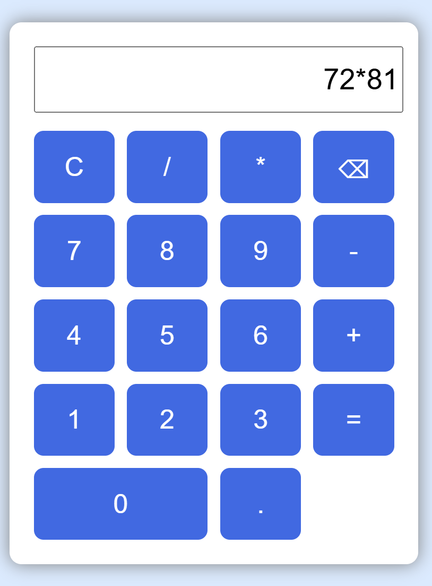

# 🧮 Digital Calculator

A simple and user-friendly digital calculator built using **HTML, CSS, and JavaScript**.

This project was created as a beginner-friendly web development project to practice **HTML structure, CSS styling, JavaScript logic, event handling, and GitHub**.

---

## 📸 Screenshot



---

## ✨ Features

- ➕ Addition
- ➖ Subtraction
- ✖️ Multiplication
- ➗ Division
- 🔄 Clear / Reset functionality
- 🔢 Decimal number calculations
- 🖥️ Simple and clean user interface
- 📱 Responsive design

---

## 🛠️ Technologies Used

| Technology | Purpose |
|------------|---------|
| HTML5 | Creates the structure of the calculator |
| CSS3 | Designs and styles the calculator |
| JavaScript | Handles calculator logic and operations |

---

## 📂 Project Structure

```text
Digital-Calculator/
│
├── index.html
├── style.css
├── script.js
├── calculator.png
└── README.md
